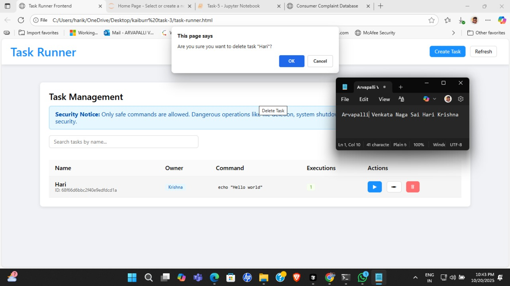
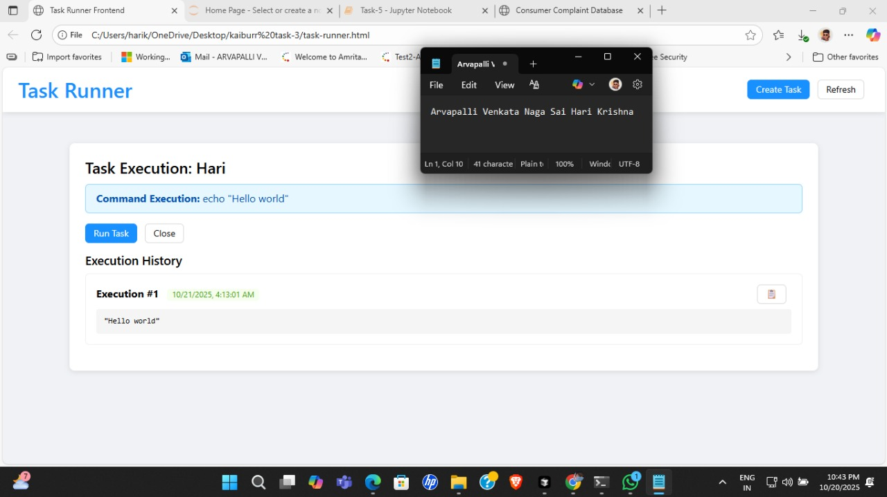
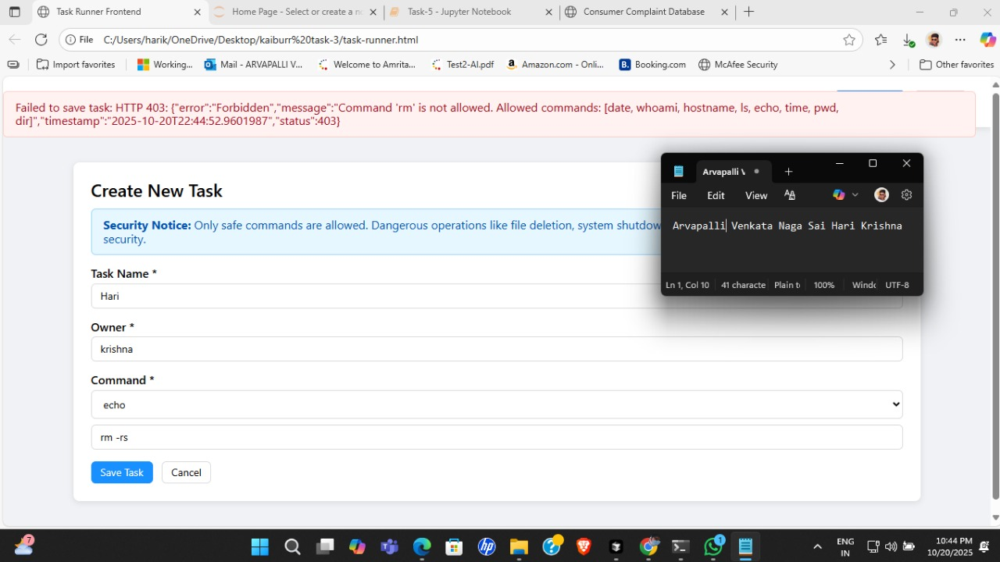

## Kaiburr Task-3

A simple React + TypeScript app for creating, listing, and executing tasks.

### Features
- Create a task with name, description, and metadata
- View all tasks and their statuses
- Execute a task and view execution results

### Tech Stack
- React, TypeScript, Vite (or similar dev server)

### Getting Started
1. Install dependencies:
   ```bash
   npm install
   ```
2. Start the dev server:
   ```bash
   npm run dev
   ```
3. Build for production:
   ```bash
   npm run build
   ```
4. Preview production build (optional):
   ```bash
   npm run preview
   ```

### Project Structure
```
public/           # Static assets
src/              # Application source code
  components/     # UI components
  api.ts          # API utilities
  types.ts        # Shared TypeScript types
```

### Screenshots
Screenshots are stored in `Screenshots/`:

| Feature | Screenshot |
|---------|------------|
| Home Page |  |
| Create Task |  |
| Edit Task |  |
| Delete Task |  |
| Task Execution |  |
| Malicious Input Handling |  |

### Scripts
- `npm run dev`: start development server
- `npm run build`: create production build
- `npm run preview`: locally preview production build

### License
This project is for demonstration/assignment purposes.


